# SOFTWARE REQUIREMENTS SPECIFICATION (SRS)

## AutoWash Pro — Smart Automated Car Wash Management System

**Chuẩn tham chiếu:** IEEE Std 830-1998 (Recommended Practice for Software Requirements Specifications)

---

# COVER PAGE

| | |
|---|---|
| **Trường** | Trường Đại học FPT (FPT University) |
| **Môn học** | SWP391 — Software Development Project |
| **Tên đề tài (VN)** | Hệ thống quản lý rửa xe tự động thông minh với đặt lịch trước và chương trình khách hàng thân thiết |
| **Tên đề tài (EN)** | Smart Automated Car Wash Management System with Advance Booking & Loyalty Program |
| **Mã đề tài** | SU26SWP01 |
| **Mã nhóm** | [Điền mã nhóm] |
| **Giảng viên hướng dẫn (GVHD)** | [Điền tên GVHD] |
| **Ngày phát hành tài liệu** | 2026-07-26 |

### Danh sách thành viên nhóm

| MSSV | Họ và tên | Vai trò |
|---|---|---|
| [Điền MSSV] | [Điền họ tên] | [Leader / Backend / Frontend / Tester / ...] |
| [Điền MSSV] | [Điền họ tên] | [Điền vai trò] |
| [Điền MSSV] | [Điền họ tên] | [Điền vai trò] |
| [Điền MSSV] | [Điền họ tên] | [Điền vai trò] |
| [Điền MSSV] | [Điền họ tên] | [Điền vai trò] |

---

## Revision History

| Version | Ngày sửa | Người sửa | Nội dung sửa |
|---|---|---|---|
| 1.0 | 2026-07-26 | [Điền tên] | Khởi tạo SRS dựa trên hệ thống thực tế (source code BE + FE) theo chuẩn IEEE 830 |
| | | | |
| | | | |

---

# 1. INTRODUCTION

## 1.1 Purpose

Tài liệu này đặc tả đầy đủ các yêu cầu chức năng (Functional Requirements) và phi chức năng (Non-Functional Requirements) của hệ thống **AutoWash Pro**, được xây dựng dựa trên đúng những gì hệ thống thực tế đang triển khai (source code Backend + Frontend tại thời điểm phát hành tài liệu).

Tài liệu phục vụ ba nhóm mục đích:
- Làm cơ sở tham chiếu thống nhất cho **Developer** khi bảo trì, mở rộng hoặc bàn giao hệ thống.
- Làm cơ sở thiết kế test case cho **Tester/QA** (đối chiếu với `doc/testcases/`).
- Làm tài liệu đánh giá học phần cho **Giảng viên hướng dẫn** theo tiêu chuẩn đặc tả yêu cầu phần mềm IEEE 830.

## 1.2 Document Conventions

- **Font chữ:** Calibri/Arial 11pt cho nội dung, 14pt Bold cho tiêu đề mục lớn (khi xuất bản Word/PDF).
- **Độ ưu tiên yêu cầu:**
  - 🔴 **High** — Chức năng lõi (core), hệ thống không thể vận hành nếu thiếu.
  - 🟡 **Medium** — Chức năng hỗ trợ nghiệp vụ, ảnh hưởng trải nghiệm nhưng không chặn luồng chính.
  - 🟢 **Low** — Chức năng tiện ích, có thể triển khai sau.
- **Ký hiệu:**
  - `BR-xx` : tham chiếu đến Business Rule tương ứng trong bảng 66 Business Rules (`doc/CONTEXT.md`).
  - `UC-xx` : mã Use Case.
  - **[High]/[Medium]/[Low]** đặt sau tên mỗi Use Case thể hiện độ ưu tiên.

## 1.3 Intended Audience

| Đối tượng | Mục đích sử dụng tài liệu |
|---|---|
| Developer (Backend/Frontend) | Hiểu đúng luồng nghiệp vụ, tránh sai lệch khi sửa/thêm chức năng |
| Tester/QA | Thiết kế test case, kiểm thử hồi quy dựa trên Basic/Alternative Flow |
| Giảng viên hướng dẫn/Hội đồng | Đánh giá mức độ hoàn thiện và tính đúng đắn của hệ thống so với yêu cầu |
| Product Owner/Leader nhóm | Quản lý phạm vi, đối chiếu tiến độ với đặc tả |

## 1.4 Project Scope

AutoWash Pro là hệ thống web quản lý dịch vụ rửa xe (ô tô & xe máy) cho phép:

- Khách hàng vãng lai (**Guest**) và khách hàng thành viên (**Member**) đặt lịch rửa xe trực tuyến, có kiểm soát khung giờ, số lượng đơn tối đa và hàng đợi ưu tiên theo hạng thành viên.
- Vận hành chương trình khách hàng thân thiết (**Loyalty Program**) nhiều hạng (Member/Silver/Gold/Platinum) với tích điểm, đổi thưởng, tự động thăng/hạ hạng.
- Quản trị viên (**Admin**) vận hành quầy: xác nhận lịch hẹn, đối soát biển số, ghi nhận thanh toán offline (tiền mặt/chuyển khoản), quản lý dịch vụ/khuyến mãi/phần thưởng, xem báo cáo vận hành theo thời gian thực (SignalR).

**Loại hình:** Web application (Responsive), kiến trúc Client-Server, REST API.

**Ngoài phạm vi (Out of scope):** Thanh toán online qua cổng thanh toán bên thứ ba (VNPAY/Momo...), xử lý hoàn tiền (refund), nhận diện biển số tự động bằng camera/AI (LPR), OTP thật qua SMS (được mô phỏng theo BR-10).

## 1.5 References

- IEEE Std 830-1998 — IEEE Recommended Practice for Software Requirements Specifications.
- `doc/CONTEXT.md` — Bảng 66 Business Rules (BR-01 → BR-66) và tổng quan tech stack (nguồn tham chiếu nghiệp vụ chính).
- `doc/WORKFLOW.md` — Luồng vận hành chi tiết theo module.
- `doc/VISION_SCOPE.md`, `doc/Smart_Car_Wash_System_Project.md` — Đề xuất dự án gốc (Topic code SU26SWP01).
- `doc/testcases/AutoWashPro_MainFlow_TestCases.xlsx` — Bộ test case luồng chính.
- Repository mã nguồn: `smart-automated-car-wash-management-BE` (Backend), `smart-automated-car-wash-management-FE` (Frontend).

---

# 2. OVERALL DESCRIPTION

## 2.1 Product Perspective

AutoWash Pro là hệ thống **độc lập** (standalone), không kết nối với cổng thanh toán, dịch vụ email/SMS hay lưu trữ ảnh của bên thứ ba trong phạm vi hiện tại:

| Hạng mục | Trạng thái tích hợp thực tế |
|---|---|
| Cổng thanh toán (VNPAY/Momo...) | ❌ Không tích hợp — chỉ ghi nhận thanh toán offline tại quầy (Cash/Transfer thủ công, BR-45) |
| Đăng nhập mạng xã hội (Google Auth...) | ❌ Không tích hợp — chỉ đăng nhập bằng Số điện thoại + Mật khẩu (BR-03) |
| Gửi email/SMS thật (SendGrid/Twilio...) | ❌ Không tích hợp — OTP xác thực xe được mô phỏng trong logic ứng dụng (BR-10) |
| Lưu trữ ảnh (Cloudinary...) | ❌ Không sử dụng |
| Realtime notification | ✅ SignalR WebSocket Hub (`AdminNotificationHub`) tự đẩy thông báo đến Admin Dashboard khi có booking mới/khách hàng mới (BR-33.1) |
| Database as a Service | ✅ PostgreSQL được host trên Supabase |

## 2.2 Product Functions (Function Tree)

```
AutoWash Pro
├── 1. Account & Vehicle Management
│   ├── 1.1 Đăng ký tài khoản Member
│   ├── 1.2 Đăng nhập (Member/Admin) + Single Session Lock
│   ├── 1.3 Xem/Cập nhật hồ sơ cá nhân
│   └── 1.4 Quản lý danh sách xe (thêm/sửa/xoá biển số)
├── 2. Service Catalog
│   └── 2.1 Xem danh mục dịch vụ theo loại xe (Car/Bike)
├── 3. Booking Engine
│   ├── 3.1 Đặt lịch rửa xe (Guest/Member)
│   ├── 3.2 Xem lịch sử đặt lịch
│   ├── 3.3 Huỷ lịch hẹn
│   └── 3.4 Auto No-show Job (nền)
├── 4. Loyalty & Rewards
│   ├── 4.1 Xem ví điểm & lịch sử tích/trừ điểm
│   ├── 4.2 Đổi điểm lấy phần thưởng (Reward)
│   ├── 4.3 Áp dụng mã khuyến mãi (Promotion)
│   ├── 4.4 Auto Tier Upgrade (real-time) / Downgrade (job hàng tháng)
│   └── 4.5 Point Expiry Job (nền)
├── 5. Admin — Vận hành quầy
│   ├── 5.1 Quản lý & xác nhận đơn đặt lịch, đối soát biển số
│   ├── 5.2 Ghi nhận thanh toán offline (Cash/Transfer)
│   └── 5.3 Nhận thông báo realtime (SignalR)
├── 6. Admin — Quản trị danh mục
│   ├── 6.1 Quản lý dịch vụ (CRUD)
│   ├── 6.2 Quản lý khuyến mãi (CRUD)
│   ├── 6.3 Quản lý phần thưởng đổi điểm (CRUD)
│   └── 6.4 Cấu hình hạng thành viên (Tier rules)
├── 7. Admin — Quản lý khách hàng
│   └── 7.1 Xem danh sách/chi tiết khách hàng, khoá/mở khoá tài khoản
└── 8. Admin — Báo cáo (Reports)
    ├── 8.1 Báo cáo tổng quan (Overview / RFM)
    ├── 8.2 Báo cáo dịch vụ phổ biến (Popular Services)
    ├── 8.3 Báo cáo công suất trạm (Occupancy)
    └── 8.4 Báo cáo hiệu quả khuyến mãi (Promotion ROI)
```

## 2.3 User Classes & Characteristics

| Actor | Định danh | Quyền hạn chính |
|---|---|---|
| **Guest** (Khách vãng lai) | Số điện thoại + Biển số xe, không cần tài khoản | Đặt tối đa 1 lịch hẹn Pending (BR-25); không lưu xe (BR-07); không tích điểm |
| **Member** (Thành viên) | Tài khoản đăng ký, SĐT = username, JWT role `Member` | Đặt tối đa 3 lịch Pending (BR-26); lưu xe không giới hạn (BR-08); tích điểm, đổi thưởng, thăng/hạ hạng tự động (Member/Silver/Gold/Platinum); chỉ xem/sửa dữ liệu của chính mình (BR-11) |
| **Admin** (kiêm vai trò Nhân viên tại quầy) | Tài khoản admin, JWT role `Admin` | Toàn quyền vận hành: xác nhận/huỷ booking, đối soát biển số (BR-44), ghi nhận thanh toán, quản lý danh mục dịch vụ/khuyến mãi/phần thưởng, khoá/mở tài khoản khách hàng, xem báo cáo; **không được sửa** dữ liệu tài chính/điểm của giao dịch đã hoàn tất (BR-12) |

> **Ghi chú thiết kế:** Hệ thống hiện chỉ có 2 role phân quyền ở tầng API (`Admin`, `Member`) — được kiểm soát bởi `RoleAuthorizationMiddleware` và các attribute `AuthorizeAdminAttribute`/`AuthorizeMemberAttribute`. Không có role "Staff" tách biệt: nhân viên vận hành tại quầy sử dụng chung tài khoản Admin.

## 2.4 Operating Environment

| Thành phần | Công nghệ thực tế |
|---|---|
| Backend | C# — ASP.NET Core 8.0 Web API (.NET 8), Entity Framework Core 8.0.10 |
| ORM/Database Driver | Npgsql.EntityFrameworkCore.PostgreSQL 8.0.10 |
| Database | PostgreSQL (hosted trên Supabase) |
| Authentication | JWT Bearer (`Microsoft.AspNetCore.Authentication.JwtBearer`), token hết hạn sau 1440 phút (24h) |
| Realtime | SignalR (`AdminNotificationHub`) |
| API Documentation | Swagger UI (Swashbuckle.AspNetCore) |
| Frontend | ReactJS 19 (Vite 8), React Router DOM 7, Tailwind CSS 4 |
| HTTP Client | Axios |
| State/Form | React Hook Form |
| Biểu đồ báo cáo | Recharts |
| Thông báo UI | react-hot-toast / react-toastify |
| Trình duyệt hỗ trợ | Chrome, Edge, Firefox bản mới (2 năm gần nhất), độ phân giải responsive từ 375px (mobile) trở lên |

## 2.5 Design & Implementation Constraints

- Bắt buộc dùng **.NET 8 (C#)** cho Backend và **ReactJS (Vite)** cho Frontend theo quy định môn học SWP391.
- Database bắt buộc **PostgreSQL**, không dùng SQL Server/MySQL.
- Không triển khai cổng thanh toán online — chỉ thanh toán offline tại quầy theo BR-45.
- Không triển khai refund/hoàn tiền (ngoài phạm vi dự án, theo `Smart_Car_Wash_System_Project.md`).
- Mỗi issue phát triển trên 1 branch riêng theo quy ước `feature/ISSUE-xx-...` / `fix/ISSUE-xx-...`, PR bắt buộc được Leader duyệt trước khi merge (xem quy ước đóng góp nội bộ nhóm).
- Thời hạn hoàn thành: theo lịch trình môn học SWP391 (16 tuần).

---

# 3. SYSTEM FEATURES / FUNCTIONAL REQUIREMENTS

## 3.1 Use Case Diagram (Tổng thể)

```mermaid
graph TB
    Guest((Guest))
    Member((Member))
    Admin((Admin))

    subgraph AutoWash Pro System
        UC1[UC01 - Đăng ký tài khoản]
        UC2[UC02 - Đăng nhập]
        UC3[UC03 - Quản lý hồ sơ & xe]
        UC4[UC04 - Xem danh mục dịch vụ]
        UC5[UC05 - Đặt lịch rửa xe]
        UC6[UC06 - Xem lịch sử đặt lịch]
        UC7[UC07 - Huỷ lịch hẹn]
        UC8[UC08 - Xem ví điểm thưởng]
        UC9[UC09 - Đổi điểm lấy quà]
        UC10[UC10 - Áp dụng mã khuyến mãi]
        UC11[UC11 - Đăng nhập Admin]
        UC12[UC12 - Quản lý & xác nhận booking]
        UC13[UC13 - Ghi nhận thanh toán offline]
        UC14[UC14 - Quản lý dịch vụ]
        UC15[UC15 - Quản lý khuyến mãi]
        UC16[UC16 - Quản lý phần thưởng]
        UC17[UC17 - Cấu hình hạng thành viên]
        UC18[UC18 - Quản lý khách hàng]
        UC19[UC19 - Xem báo cáo vận hành]
        UC20[UC20 - Nhận thông báo realtime]
    end

    Guest --> UC4
    Guest --> UC5
    Guest --> UC7

    Member --> UC1
    Member --> UC2
    Member --> UC3
    Member --> UC4
    Member --> UC5
    Member --> UC6
    Member --> UC7
    Member --> UC8
    Member --> UC9
    Member --> UC10

    Admin --> UC11
    Admin --> UC12
    Admin --> UC13
    Admin --> UC14
    Admin --> UC15
    Admin --> UC16
    Admin --> UC17
    Admin --> UC18
    Admin --> UC19
    Admin --> UC20

    UC5 -.include.-> UC10
    UC12 -.include.-> UC13
```



---

## 3.2 Use Case Details

### UC01 — Đăng ký tài khoản Member **[High]**

- **Actor:** Guest (người chưa có tài khoản)
- **Description:** Cho phép người dùng tạo tài khoản Member để sử dụng các quyền lợi tích điểm, thăng hạng, lưu xe.
- **Pre-condition:** Người dùng chưa có tài khoản trùng Số điện thoại trong hệ thống.
- **Post-condition:** Tài khoản Member mới được tạo với hạng mặc định `Member` (BR-14), mật khẩu được mã hoá Bcrypt (BR-06).
- **Basic Flow:**
  1. Người dùng vào trang `/register`, nhập Họ tên, Số điện thoại, Mật khẩu, Xác nhận mật khẩu (BR-04).
  2. Hệ thống kiểm tra định dạng và tính khớp của Mật khẩu/Xác nhận mật khẩu.
  3. Hệ thống kiểm tra Số điện thoại chưa tồn tại (BR-05).
  4. Hệ thống mã hoá mật khẩu bằng Bcrypt và lưu tài khoản mới với hạng `Member`.
  5. Hệ thống trả về thông báo thành công, chuyển hướng sang trang đăng nhập.
- **Alternative/Exception Flows:**
  - A1: Số điện thoại đã tồn tại → hệ thống từ chối, hiển thị lỗi "Số điện thoại đã được sử dụng" (BR-05).
  - A2: Mật khẩu và Xác nhận mật khẩu không khớp → hiển thị lỗi ngay tại form (client-side validation).
  - A3: Thiếu trường bắt buộc → chặn submit, highlight field lỗi.
- **UI Screen:** [Chèn ảnh chụp màn hình trang `/register` tại đây]

---

### UC02 — Đăng nhập **[High]**

- **Actor:** Member, Admin
- **Description:** Xác thực người dùng bằng Số điện thoại (Member) hoặc tài khoản Admin, trả về JWT token.
- **Pre-condition:** Tài khoản đã tồn tại và không bị khoá (`IsLocked = false`, BR-13).
- **Post-condition:** Người dùng nhận JWT token (hết hạn sau 1440 phút), phiên đăng nhập cũ trên thiết bị khác bị vô hiệu hoá (Single Concurrent Session Lock).
- **Basic Flow:**
  1. Người dùng nhập Số điện thoại/Mật khẩu tại `/login`.
  2. Hệ thống xác thực thông tin, so khớp mật khẩu Bcrypt.
  3. Hệ thống phát hành JWT chứa claim `role` (Member/Admin) và cập nhật SessionToken hiện hành (khoá phiên cũ nếu có).
  4. Frontend lưu token, chuyển hướng vào trang chủ (Member) hoặc `/admin/dashboard` (Admin).
- **Alternative/Exception Flows:**
  - A1: Sai số điện thoại/mật khẩu → 401, thông báo "Sai thông tin đăng nhập".
  - A2: Tài khoản bị khoá (`IsLocked = true`) → chặn đăng nhập, thông báo tài khoản bị khoá (BR-13).
  - A3: Phiên đăng nhập cũ đang hoạt động ở thiết bị khác → phiên cũ bị buộc đăng xuất khi phiên mới được tạo (single-session policy), FE hiển thị toast thông báo hết phiên khi phát hiện 401 do session bị thay thế.
- **UI Screen:** [Chèn ảnh chụp màn hình trang `/login` tại đây]

---

### UC03 — Quản lý hồ sơ & danh sách xe **[High]**

- **Actor:** Member
- **Description:** Xem/cập nhật thông tin cá nhân; thêm, sửa, xoá biển số xe trong hồ sơ.
- **Pre-condition:** Đã đăng nhập với role Member.
- **Post-condition:** Thông tin hồ sơ/danh sách xe được cập nhật và phản ánh ngay ở màn hình đặt lịch.
- **Basic Flow:**
  1. Member vào `/profile`, xem thông tin cá nhân và danh sách xe đã lưu.
  2. Member thêm xe mới bằng cách nhập biển số theo đúng định dạng biển số Việt Nam (BR-08.1, ví dụ 30F-123.45, 51A-12345).
  3. Hệ thống lưu biển số vào danh sách xe của Member (không giới hạn số lượng — BR-08).
  4. Member có thể sửa/xoá xe đã lưu.
- **Alternative/Exception Flows:**
  - A1: Biển số sai định dạng chuẩn Việt Nam → từ chối lưu, hiển thị lỗi định dạng.
  - A2: Cùng một biển số có thể tồn tại ở nhiều tài khoản khác nhau (BR-09, ví dụ xe gia đình dùng chung) — hệ thống không chặn trùng biển số giữa các Member khác nhau.
- **UI Screen:** [Chèn ảnh chụp màn hình trang `/profile` tại đây]

---

### UC04 — Xem danh mục dịch vụ **[High]**

- **Actor:** Guest, Member
- **Description:** Xem danh sách dịch vụ rửa xe theo loại phương tiện (Car/Bike) kèm giá, mô tả, thời gian ước tính.
- **Pre-condition:** Không yêu cầu đăng nhập.
- **Post-condition:** Người dùng thấy danh sách dịch vụ đang hoạt động (`IsActive = true`), giá đã bao gồm VAT (BR-36).
- **Basic Flow:**
  1. Người dùng chọn loại xe (Car/Bike) tại trang Services.
  2. Hệ thống trả về danh sách dịch vụ tương ứng, ẩn các dịch vụ `IsActive = false` (BR-37).
  3. Người dùng xem chi tiết: tên, giá gross (đã VAT), mô tả các bước, thời gian ước tính (BR-35, BR-36).
- **Alternative/Exception Flows:**
  - A1: Không có dịch vụ nào active cho loại xe đã chọn → hiển thị trạng thái rỗng.
- **UI Screen:** [Chèn ảnh chụp màn hình trang danh mục dịch vụ tại đây]

---

### UC05 — Đặt lịch rửa xe **[High]**

- **Actor:** Guest, Member
- **Description:** Đặt lịch hẹn rửa xe theo khung giờ còn trống, áp dụng ưu tiên theo hạng thành viên, tự động áp perks/promotion.
- **Pre-condition:**
  - Guest: số điện thoại chưa có đơn Pending nào khác (BR-25).
  - Member: chưa đạt giới hạn 3 đơn Pending (BR-26), tài khoản không bị khoá đặt lịch do phạt No-show (BR-66).
  - Thời điểm đặt cách giờ hẹn tối thiểu 60 phút (BR-29), trong cửa sổ đặt lịch cho phép theo hạng (BR-15 → BR-18).
- **Post-condition:** Booking được tạo ở trạng thái `Pending`, khung giờ được giữ chỗ (station chỉ phục vụ 1 xe/lượt — BR-31), điểm/reward nếu áp dụng được khoá tạm thời (BR-62).
- **Basic Flow:**
  1. Người dùng chọn dịch vụ, loại xe, biển số (chọn từ danh sách đã lưu hoặc nhập mới — BR-08), ngày giờ mong muốn.
  2. Hệ thống kiểm tra khung giờ còn trống (tính cả buffer 5 phút giữa các ca — BR-30) và trạm không ở trạng thái bảo trì (BR-32).
  3. Hệ thống tự động áp dụng chiết khấu theo hạng thành viên (BR-23) mà không cần thao tác thủ công.
  4. (Tuỳ chọn) Member áp dụng mã khuyến mãi (UC10) và/hoặc đổi điểm thưởng (UC09).
  5. Hệ thống tính `FinalAmount = BaseAmount - TierDiscount - RewardDiscount - PromotionDiscount` (BR-39).
  6. Hệ thống tạo booking trạng thái `Pending`, gửi thông báo realtime đến Admin Dashboard qua SignalR (BR-33.1).
- **Alternative/Exception Flows:**
  - A1: Khung giờ cuối cùng có nhiều người đặt cùng lúc → hệ thống xếp hàng ưu tiên `Platinum > Gold > Silver > Member > Guest` (BR-19); cùng hạng thì ai bấm xác nhận trước được ưu tiên (BR-20).
  - A2: Vượt quá số đơn Pending cho phép → từ chối tạo booking mới, yêu cầu hoàn tất/huỷ đơn cũ trước (BR-26/BR-27).
  - A3: Cùng biển số có lịch hẹn khác cách dưới 120 phút → từ chối (BR-28).
  - A4: Trạm/dịch vụ đang bảo trì → chặn đặt lịch (BR-32).
  - A5: Tài khoản đang bị phạt No-show (3 lần/30 ngày) → chặn đặt lịch online 15 ngày (BR-66).
- **UI Screen:** [Chèn ảnh chụp màn hình trang `/booking` tại đây]

---

### UC06 — Xem lịch sử đặt lịch **[Medium]**

- **Actor:** Member
- **Description:** Xem danh sách các booking đã/đang thực hiện, trạng thái hiện tại.
- **Pre-condition:** Đã đăng nhập.
- **Post-condition:** Hiển thị danh sách booking của chính Member đó (BR-11, không xem được của người khác).
- **Basic Flow:**
  1. Member vào `/bookings`.
  2. Hệ thống trả về danh sách booking gắn với tài khoản, sắp xếp theo thời gian gần nhất.
  3. Member xem chi tiết trạng thái: Pending/Completed/Failed/Cancelled/No-show.
- **Alternative/Exception Flows:**
  - A1: Chưa có booking nào → hiển thị trạng thái rỗng kèm gợi ý đặt lịch.
- **UI Screen:** [Chèn ảnh chụp màn hình trang `/bookings` tại đây]

---

### UC07 — Huỷ lịch hẹn **[Medium]**

- **Actor:** Guest, Member
- **Description:** Tự huỷ một lịch hẹn đang chờ xử lý.
- **Pre-condition:** Booking đang ở trạng thái `Pending` và thời điểm huỷ cách giờ hẹn tối thiểu 2 tiếng (BR-63).
- **Post-condition:** Booking chuyển sang `Cancelled`; nếu có điểm đã khoá (Hold) cho booking này, điểm được hoàn trả về đúng hạn sử dụng gốc (BR-62).
- **Basic Flow:**
  1. Member/Guest chọn "Huỷ lịch" trên booking đang Pending.
  2. Hệ thống kiểm tra điều kiện thời gian (≥ 2 tiếng trước giờ hẹn).
  3. Hệ thống chuyển trạng thái sang `Cancelled`, hoàn điểm đã khoá (nếu có).
- **Alternative/Exception Flows:**
  - A1: Huỷ trễ hơn 2 tiếng trước giờ hẹn → từ chối, thông báo không đủ điều kiện huỷ miễn phí (BR-63).
  - A2: Booking đã ở trạng thái cuối (Completed/Failed/Cancelled/No-show) → không cho phép thao tác (BR-64).
- **UI Screen:** [Chèn ảnh chụp màn hình xác nhận huỷ lịch tại đây]

---

### UC08 — Xem ví điểm thưởng (Loyalty Wallet) **[Medium]**

- **Actor:** Member
- **Description:** Xem số dư điểm hiện tại, lịch sử tích/trừ điểm, ngày hết hạn từng lô điểm.
- **Pre-condition:** Đã đăng nhập.
- **Post-condition:** Hiển thị đúng số điểm khả dụng, đã trừ các điểm hết hạn 12 tháng (BR-55, BR-57).
- **Basic Flow:**
  1. Member vào `/loyalty`.
  2. Hệ thống trả về tổng điểm khả dụng, breakdown theo từng lô điểm còn hạn (FIFO — BR-56).
  3. Member xem lịch sử: điểm cộng khi Completed (BR-52), điểm trừ khi đổi thưởng.
- **Alternative/Exception Flows:**
  - A1: Không có điểm nào → hiển thị số dư 0, gợi ý đặt lịch để tích điểm.
- **UI Screen:** [Chèn ảnh chụp màn hình trang `/loyalty` tại đây]

---

### UC09 — Đổi điểm lấy phần thưởng (Redeem Reward) **[Medium]**

- **Actor:** Member
- **Description:** Dùng điểm tích luỹ để đổi giảm giá (theo % hoặc số tiền cố định) khi đặt lịch.
- **Pre-condition:** Số điểm khả dụng ≥ 50 điểm (BR-59).
- **Post-condition:** Điểm sử dụng chuyển sang trạng thái Hold; số tiền giảm được áp trực tiếp vào hoá đơn, không vượt quá 50% giá trị đơn (BR-60).
- **Basic Flow:**
  1. Tại màn hình đặt lịch, Member chọn phần thưởng muốn đổi.
  2. Hệ thống kiểm tra số dư điểm ≥ 50 (BR-59) và mức giảm không vượt 50% hoá đơn (BR-60).
  3. Hệ thống trừ điểm theo FIFO (BR-56), khoá (Hold) số điểm đã dùng.
  4. Hệ thống tính giảm giá: Phần trăm → `BaseAmount * (DiscountValue/100)`; Cố định → trừ thẳng số tiền (BR-58.1).
- **Alternative/Exception Flows:**
  - A1: Điểm khả dụng < 50 → ẩn/khoá chức năng đổi thưởng (BR-59).
  - A2: Mức giảm vượt 50% hoá đơn → hệ thống giới hạn lại tối đa 50% (BR-60).
  - A3: Booking bị Cancelled/Failed sau khi đã dùng điểm → hoàn điểm về tài khoản, giữ nguyên hạn sử dụng gốc (BR-62).
  - A4: Điểm thưởng không được quy đổi thành tiền mặt hoặc thối lại (BR-61).
- **UI Screen:** [Chèn ảnh chụp màn hình chọn phần thưởng tại đây]

---

### UC10 — Áp dụng mã khuyến mãi (Promotion) **[Medium]**

- **Actor:** Member, Guest
- **Description:** Nhập/áp dụng mã khuyến mãi đang hoạt động để giảm giá booking.
- **Pre-condition:** Mã khuyến mãi còn hiệu lực (theo thời gian, đã xử lý đúng múi giờ local — xem `PromotionService`).
- **Post-condition:** `PromotionDiscount` được cộng vào công thức tính `FinalAmount` (BR-39).
- **Basic Flow:**
  1. Người dùng nhập mã khuyến mãi tại màn hình đặt lịch.
  2. Hệ thống kiểm tra mã tồn tại, còn hiệu lực theo khung thời gian (start/end date, so sánh theo local timezone).
  3. Hệ thống áp dụng mức giảm vào tổng hoá đơn.
- **Alternative/Exception Flows:**
  - A1: Mã không tồn tại/đã hết hạn → từ chối áp dụng, hiển thị lỗi.
  - A2: Mã đã hết hạn sử dụng theo lượt/điều kiện áp dụng → từ chối.
- **UI Screen:** [Chèn ảnh chụp màn hình nhập mã khuyến mãi tại đây]

---

### UC11 — Đăng nhập Admin **[High]**

- **Actor:** Admin
- **Description:** Xác thực quản trị viên để truy cập khu vực `/admin/*`.
- **Pre-condition:** Tài khoản Admin tồn tại.
- **Post-condition:** JWT với claim `role = Admin` được cấp; mọi endpoint `/api/admin/*` (trừ `/api/admin/auth/login`) yêu cầu claim này (`RoleAuthorizationMiddleware`).
- **Basic Flow:**
  1. Admin đăng nhập tại form admin (dùng chung `/login` hoặc endpoint `/api/admin/auth/login`).
  2. Hệ thống xác thực, phát hành JWT role Admin.
  3. Admin được điều hướng vào `/admin/dashboard`.
- **Alternative/Exception Flows:**
  - A1: Chưa đăng nhập truy cập `/api/admin/*` → 401 Unauthorized.
  - A2: Đăng nhập bằng tài khoản không có quyền Admin truy cập trang admin → 403 Forbidden.
- **UI Screen:** [Chèn ảnh chụp màn hình đăng nhập Admin tại đây]

---

### UC12 — Quản lý & xác nhận đơn đặt lịch (Admin) **[High]**

- **Actor:** Admin
- **Description:** Xem danh sách booking realtime, đối soát biển số khi xe đến, cập nhật trạng thái đơn hàng.
- **Pre-condition:** Đã đăng nhập Admin.
- **Post-condition:** Trạng thái booking được cập nhật đúng theo luồng cho phép (BR-40), không thể đảo ngược trạng thái cuối (BR-41).
- **Basic Flow:**
  1. Admin vào `/admin/bookings`, xem danh sách booking theo trạng thái.
  2. Khi xe đến trạm, Admin đối soát biển số thực tế với biển số đã đặt (BR-44).
  3. Nếu khớp, Admin xác nhận tiến trình: `Pending → Completed` (sau khi hoàn tất rửa xe và thanh toán — xem UC13).
  4. Hệ thống tự động chèn buffer 5 phút giữa các ca để dọn trạm (BR-30).
- **Alternative/Exception Flows:**
  - A1: Biển số không khớp hoặc phát sinh sự cố → Admin chuyển đơn sang `Cancelled` hoặc `Failed` (BR-44).
  - A2: Xe không đến trong vòng 15 phút kể từ giờ hẹn → hệ thống tự động chuyển `No-show` (BR-65, xử lý bởi background job).
  - A3: Cố gắng cập nhật trạng thái của đơn đã ở trạng thái cuối → hệ thống từ chối (BR-41, BR-64).
  - A4: Sự cố kỹ thuật hoặc nhân viên nhấn "Dừng khẩn cấp" → hệ thống ghi log ngoại lệ, cảnh báo tức thời tới Admin Dashboard (BR-43).
- **UI Screen:** [Chèn ảnh chụp màn hình `/admin/bookings` tại đây]

---

### UC13 — Ghi nhận thanh toán offline **[High]**

- **Actor:** Admin
- **Description:** Ghi nhận thanh toán tại quầy bằng Tiền mặt hoặc Chuyển khoản, chuyển đơn sang Completed.
- **Pre-condition:** Booking đã được xác nhận thực hiện xong dịch vụ, chưa được thanh toán trước đó.
- **Post-condition:** Đơn chuyển `Completed`, `PaymentTimestamp` được ghi nhận (BR-46); điểm thưởng được cộng vào tài khoản Member (BR-52) nếu áp dụng, tối đa 500 điểm/đơn (BR-53); tự động thăng hạng real-time nếu đạt mốc (BR-21).
- **Basic Flow:**
  1. Admin chọn hình thức thanh toán: Cash hoặc Transfer (BR-45).
  2. Nếu Cash: Admin bắt buộc bấm xác nhận "Đã thu đủ tiền mặt" (BR-47).
  3. Hệ thống ghi nhận `PaymentTimestamp`, chuyển đơn sang `Completed`.
  4. Hệ thống cộng điểm thưởng (nếu Member), quét điều kiện thăng hạng ngay lập tức (BR-21, BR-21.1).
- **Alternative/Exception Flows:**
  - A1: Booking đã thanh toán trước đó → chặn thao tác thanh toán lần 2 (BR-48).
  - A2: Booking bị huỷ/failed → không cộng điểm (BR-54).
- **UI Screen:** [Chèn ảnh chụp màn hình xác nhận thanh toán tại đây]

---

### UC14 — Quản lý dịch vụ (Admin) **[Medium]**

- **Actor:** Admin
- **Description:** Thêm/sửa/ẩn dịch vụ trong danh mục.
- **Pre-condition:** Đã đăng nhập Admin.
- **Post-condition:** Danh mục dịch vụ được cập nhật; giá mới không ảnh hưởng đến booking đã xác nhận trước đó (BR-38).
- **Basic Flow:**
  1. Admin vào `/admin/services`, tạo dịch vụ mới với đầy đủ metadata: tên, giá, mô tả, loại hoá chất, thời gian ước tính (BR-35).
  2. Admin có thể cập nhật giá hoặc chuyển `IsActive = false` để ẩn dịch vụ khỏi màn hình khách hàng (BR-37).
- **Alternative/Exception Flows:**
  - A1: Thiếu metadata bắt buộc → chặn lưu (BR-35).
  - A2: Cập nhật giá dịch vụ đang có booking Pending sử dụng → giá cũ vẫn áp dụng cho các booking đã xác nhận (BR-38).
- **UI Screen:** [Chèn ảnh chụp màn hình `/admin/services` tại đây]

---

### UC15 — Quản lý khuyến mãi (Admin) **[Medium]**

- **Actor:** Admin
- **Description:** Tạo/sửa/xoá mã khuyến mãi, phạm vi áp dụng, thời gian hiệu lực.
- **Pre-condition:** Đã đăng nhập Admin.
- **Post-condition:** Mã khuyến mãi mới/chỉnh sửa có hiệu lực ngay theo khung thời gian cấu hình (đã xử lý đúng timezone local).
- **Basic Flow:**
  1. Admin vào `/admin/promotions`, tạo mã khuyến mãi mới (mã, % / số tiền giảm, ngày bắt đầu/kết thúc).
  2. Admin lưu, hệ thống kiểm tra tính hợp lệ của khung thời gian.
  3. Admin có thể cập nhật mã đang tồn tại (đã fix lỗi cập nhật không lưu ở ISSUE-05).
- **Alternative/Exception Flows:**
  - A1: Ngày kết thúc trước ngày bắt đầu → từ chối lưu.
- **UI Screen:** [Chèn ảnh chụp màn hình `/admin/promotions` tại đây]

---

### UC16 — Quản lý phần thưởng đổi điểm (Admin) **[Low]**

- **Actor:** Admin
- **Description:** Cấu hình danh mục phần thưởng (Reward) có thể đổi bằng điểm, dạng % hoặc số tiền cố định (BR-58.1).
- **Pre-condition:** Đã đăng nhập Admin.
- **Post-condition:** Danh mục reward cập nhật, hiển thị ngay ở UC09.
- **Basic Flow:**
  1. Admin tạo reward mới: tên, loại giảm giá (Percentage/Fixed), giá trị, số điểm cần đổi.
  2. Admin lưu, reward xuất hiện trong danh sách đổi thưởng của Member.
- **Alternative/Exception Flows:**
  - A1: Giá trị % vượt 100 → chặn lưu.
- **UI Screen:** [Chèn ảnh chụp màn hình quản lý reward tại đây]

---

### UC17 — Cấu hình hạng thành viên (Tier) **[Low]**

- **Actor:** Admin
- **Description:** Cấu hình ngưỡng chi tiêu, cửa sổ đặt lịch, tỷ lệ tích điểm theo từng hạng.
- **Pre-condition:** Đã đăng nhập Admin.
- **Post-condition:** Ngưỡng hạng mới được áp dụng cho lần tính Effective Tier tiếp theo (BR-21.1).
- **Basic Flow:**
  1. Admin vào `/admin/tiers`, xem cấu hình hiện tại (Silver ≥ 500k, Gold ≥ 1.5M, Platinum ≥ 3M — BR-21.1).
  2. Admin điều chỉnh mốc chi tiêu và tỷ lệ tích điểm (mặc định 10.000đ = 1 điểm — BR-51).
- **Alternative/Exception Flows:**
  - A1: Mốc hạng cao hơn cấu hình thấp hơn mốc hạng thấp hơn nó → hệ thống nên cảnh báo cấu hình không hợp lệ.
- **UI Screen:** [Chèn ảnh chụp màn hình `/admin/tiers` tại đây]

---

### UC18 — Quản lý khách hàng (Admin) **[Medium]**

- **Actor:** Admin
- **Description:** Xem danh sách/chi tiết khách hàng, lịch sử booking, khoá/mở khoá tài khoản.
- **Pre-condition:** Đã đăng nhập Admin.
- **Post-condition:** Tài khoản Member bị khoá (`IsLocked = true`) sẽ không đăng nhập/đặt lịch được (BR-13).
- **Basic Flow:**
  1. Admin vào `/admin/customers`, xem danh sách khách hàng.
  2. Admin chọn 1 khách hàng để xem chi tiết: hồ sơ, lịch sử booking, điểm thưởng, hạng hiện tại (chỉ xem — BR-12).
  3. Admin khoá/mở khoá tài khoản khi cần (ví dụ xử lý vi phạm).
- **Alternative/Exception Flows:**
  - A1: Admin cố sửa dữ liệu tài chính/điểm của giao dịch đã Completed → hệ thống không cho phép (BR-12).
- **UI Screen:** [Chèn ảnh chụp màn hình `/admin/customers` tại đây]

---

### UC19 — Xem báo cáo vận hành (Admin) **[Medium]**

- **Actor:** Admin
- **Description:** Xem các báo cáo: tổng quan hoạt động, dịch vụ phổ biến, công suất trạm (occupancy), hiệu quả khuyến mãi (ROI).
- **Pre-condition:** Đã đăng nhập Admin.
- **Post-condition:** Dữ liệu báo cáo được lọc theo khoảng thời gian Admin chọn.
- **Basic Flow:**
  1. Admin vào `/admin/reports` (hoặc các trang con `reports/services`, `reports/occupancy`, `reports/promotions`).
  2. Admin chọn khoảng thời gian, hệ thống trả về số liệu tổng hợp (biểu đồ Recharts).
  3. Admin xuất/xem chi tiết theo từng loại báo cáo.
- **Alternative/Exception Flows:**
  - A1: Khoảng thời gian không hợp lệ (ngày kết thúc trước ngày bắt đầu) → hệ thống validate và từ chối.
  - A2: Không có dữ liệu trong khoảng đã chọn → hiển thị trạng thái rỗng.
- **UI Screen:** [Chèn ảnh chụp màn hình `/admin/reports` tại đây]

---

### UC20 — Nhận thông báo realtime (Admin) **[Low]**

- **Actor:** Admin
- **Description:** Nhận thông báo tức thời khi có booking mới hoặc khách hàng mới đăng ký, không cần refresh trang.
- **Pre-condition:** Admin đang đăng nhập và mở Dashboard (kết nối SignalR Hub thành công).
- **Post-condition:** Toast/badge thông báo xuất hiện tức thời trên Dashboard.
- **Basic Flow:**
  1. Admin mở `/admin/dashboard`, FE kết nối tới `AdminNotificationHub` qua SignalR.
  2. Khi có booking mới/khách hàng mới đăng ký, BE broadcast sự kiện qua Hub (BR-33.1).
  3. FE nhận sự kiện, hiển thị thông báo realtime.
- **Alternative/Exception Flows:**
  - A1: Mất kết nối SignalR → FE tự động reconnect; nếu không thành công, thông báo chỉ cập nhật khi Admin refresh/gọi lại API.
- **UI Screen:** [Chèn ảnh chụp màn hình thông báo realtime trên Dashboard tại đây]

---

### UC21 — Background Jobs (Hệ thống tự động) **[High]**

- **Actor:** Hệ thống (Scheduled Job, không có tác nhân người dùng trực tiếp)
- **Description:** Các tác vụ nền chạy tự động đảm bảo tính đúng đắn nghiệp vụ mà không cần Admin can thiệp thủ công.
- **Danh sách job:**
  | Job | Tần suất | Nghiệp vụ | BR liên quan |
  |---|---|---|---|
  | Auto No-show Job | Định kỳ (kiểm tra liên tục) | Chuyển booking `Pending` quá 15 phút không check-in sang `No-show` | BR-65 |
  | Tier Downgrade Job | 00:00 ngày 1 hàng tháng | Xét hạ hạng dựa trên tổng chi tiêu 12 tháng gần nhất | BR-22 |
  | Point Expiry Job | Định kỳ hằng ngày | Khấu trừ về 0 các lô điểm đã quá hạn 12 tháng, không thể khôi phục | BR-55, BR-57 |
  | No-show Suspension | Kích hoạt khi đủ điều kiện | Khoá đặt lịch online 15 ngày nếu tài khoản có 3 lần No-show/30 ngày | BR-66 |
- **UI Screen:** Không áp dụng (job chạy nền, không có giao diện).

---

# 4. NON-FUNCTIONAL REQUIREMENTS (NFR)

## 4.1 Performance

| Yêu cầu | Chỉ tiêu mục tiêu | Ghi chú |
|---|---|---|
| Thời gian phản hồi API | < 2 giây với tải ~100 concurrent users cho các endpoint đọc dữ liệu (danh mục dịch vụ, booking history) | Cần đo đạc bằng công cụ load-test (k6/JMeter) trước khi công bố chính thức |
| Thời gian tính khung giờ đặt lịch | < 1 giây để trả kết quả slot còn trống | Phụ thuộc số lượng booking đồng thời trong `BookingSettings.MaxParallelSlots` |
| Độ trễ thông báo realtime (SignalR) | < 1 giây từ khi sự kiện phát sinh đến khi Admin nhận thông báo | Trong điều kiện kết nối WebSocket ổn định |

## 4.2 Security

- **Mã hoá mật khẩu:** Bcrypt (thư viện `BCrypt.Net`) — không lưu plaintext (BR-06).
- **Xác thực:** JWT Bearer Token (`Microsoft.AspNetCore.Authentication.JwtBearer`), thời hạn 1440 phút; secret key cấu hình qua `appsettings`.
- **Phân quyền (RBAC):** `RoleAuthorizationMiddleware` chặn toàn bộ `/api/admin/*` nếu claim `role` khác `Admin` (403) hoặc chưa đăng nhập (401); `AuthorizeMemberAttribute` bảo vệ endpoint chỉ dành cho Member.
- **Single Concurrent Session:** Mỗi tài khoản chỉ duy trì một phiên đăng nhập hợp lệ tại một thời điểm; đăng nhập ở thiết bị mới sẽ vô hiệu hoá token phiên cũ (chống chia sẻ tài khoản/chiếm phiên).
- **Data Isolation:** Member chỉ truy vấn được dữ liệu gắn với tài khoản của chính mình (BR-11); Admin có quyền đọc toàn bộ nhưng không sửa dữ liệu tài chính đã chốt (BR-12).
- **Chống SQL Injection:** Toàn bộ truy vấn qua Entity Framework Core (LINQ, tham số hoá), không dựng raw SQL nối chuỗi trực tiếp từ input người dùng.
- **Chống XSS:** ReactJS tự động escape nội dung render; không dùng `dangerouslySetInnerHTML` với dữ liệu chưa qua kiểm soát.
- **CORS:** Cấu hình middleware cho phép preflight (OPTIONS) đi qua trước khi kiểm tra JWT, tránh chặn nhầm request CORS hợp lệ.

## 4.3 Usability

- Giao diện **responsive**, tối ưu từ độ phân giải mobile (375px) đến desktop, dùng Tailwind CSS breakpoints.
- Tông màu chủ đạo phân biệt theo hạng thành viên: Silver (xám bạc), Gold (vàng hổ phách/amber), Platinum (tím violet).
- Thông báo trạng thái thao tác (thành công/lỗi) hiển thị dạng toast (react-hot-toast/react-toastify), không dùng `alert()` mặc định trình duyệt.
- Loading state dùng skeleton/spinner khi tải dữ liệu bất đồng bộ (code-splitting bằng `React.lazy` + `Suspense`).

## 4.4 Reliability & Availability

- Hệ thống thiết kế hoạt động **24/7** (web-based, không phụ thuộc giờ hành chính) với mục tiêu **uptime 99%** khi triển khai production.
- Database Supabase (managed PostgreSQL) đảm bảo backup/khôi phục ở tầng hạ tầng theo chính sách của Supabase.
- Cơ chế **Emergency Stop Log** (BR-43): mọi lỗi vận hành hoặc sự cố kỹ thuật được ghi log và cảnh báo tức thời tới Admin, tránh mất dữ liệu giao dịch đang xử lý.
- Trạng thái booking là **immutable** sau khi đạt trạng thái cuối (Completed/Failed/Cancelled/No-show — BR-41, BR-64), đảm bảo tính toàn vẹn dữ liệu lịch sử giao dịch.

---

*Hết tài liệu — phiên bản 1.0.*
